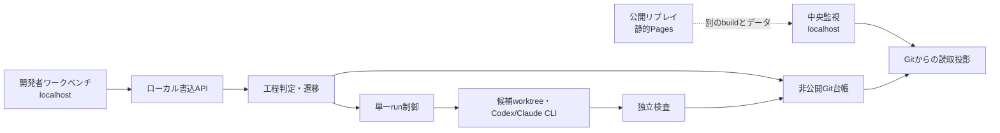

# Design Spec — 開発者ワークベンチと全工程のローカル実行

**版**: 0.1 | **日付**: 2026-09-27 | **状態**: 提案中（未実装） | 要求: [developer-journey-requirement-spec.md](developer-journey-requirement-spec.md)

本書は[単一run設計](local-execution-design-spec.md)の外側に、J-SIX Phase 0〜6の案件・提出・ゲートを置く。公開[リプレイ設計](design-spec.md)は変更しない。実装は段階ごとの計画・独立レビュー後であり、ここに書くAPIや画面はまだ存在しない。

## 1. 境界と実行構成

localhost の書込APIと画面は明示的な `poc` 起動時だけ提供し、公開 Vite/React bundle とサーバーを分ける。画面と端末コマンドは同じドメイン関数を呼ぶ。ブラウザはGit台帳やCLIを直接操作しない。Hubはユーザーが別の端末で行った操作を防げず、管理下で記録・検査した成果物だけを受け入れる。

案件の操作画面と中央監視は同じGit投影の別ビュー。前者は「次に何を提出・判断するか」、後者は案件間のPhase・停止・証跡を示す。公開リプレイの `data/events.jsonl` とローカル台帳を結合しない。

## 2. 固定processと案件作成

Hub は `process.lock.json` の参照とSHA256に一致したプロセス定義だけを読み、`phases`、`gates`、`outputs`、`state_machines`、`transitions` を検証する。案件は定義のcommit/SHA256、対象repoと基準commit、方針hash、題材IDを最初のrecordに保存する。不明なPhase/Gate/遷移、欠落した必須属性、lockと取得本文の不一致では作成・遷移を保留する。

現行lockは `process-v0.1.0`、SHA256 `2a7be7e7500e04baee05c411bfa731a0bb5291be9c881d7be41f797d46f6fc9c`。全工程実装前に本体commit `1101258e5aec249273fcc5d546db0341d456e1be` のYAML、SHA256 `f690d777c4e00106a34ba26ca7372e725d3cf6ce1bd51b1600447a54a327ac0e` へ別レビュー付きで固定し直す。差分はG3省略/L4、P5品質判断に関する説明3箇所で、Phase/Gate IDと遷移は同じ。取得失敗時に旧版へ自動フォールバックしない。lock変更で公開リプレイの表示・テスト・CIを確認する。

工程固有の「提出物の検証方法」はプロセス定義の `outputs` と `gates.layers.checks.criteria` を参照するHubの**版付きローカルPoC方針**として保持する。画面だけに独自の通過条件を置かない。方針更新は過去の判断をそのまま新案件へ流用しない。

## 3. 非公開Git台帳と投影

既存[単一run設計 §2](local-execution-design-spec.md#2-git-正本記録形式)のローカル台帳に案件・工程recordを加える。正本refは一つの直列化された履歴とし、追記時に期待old SHAを指定して更新・再読込する。別プロセスからの同時操作は既存の原子的lockで直列化し、lock残留/更新応答不明を自動成功扱いしない。対象Gitの成果物と候補refは台帳と分離する。

| record | 固定する主な値 |
|---|---|
| `project.created` | project ID、process版/ハッシュ、対象repo/基準commit、方針ハッシュ、合成題材 |
| `artifact.submitted` | project/Phase、種別、対象commit/path、内容SHA256、関連REQ/PROP/タスク、提出者ラベル、世代 |
| `phase.review_requested` | 提出版の集合、必須証拠の照合結果、適用方針、要求世代 |
| `gate.check_recorded` | ゲート/層/チェックID、対象と設定版、実行主体、結果、証拠のhash/参照。未実行は合格にならない |
| `gate.local_decision` | 対象、模擬役割、判断/理由/時刻/期限、参照したチェック、`simulated: true` |
| `phase.transitioned` | from/to、許可したゲート、対象版・方針版・判断のID、世代 |
| `phase.reopened` | 差戻し/逆戻り理由、影響範囲、旧判断の失効・再確認待ち、世代更新 |
| `task.*` / `dispatch.*` | 既存単一run設計のrun/command IDと、P3で固定したタスク・許可範囲の参照 |

全recordはschema版、record ID、前recordのhashまたはGit親commit、操作時刻、project IDを持つ。個人情報・生ログ・認証値・絶対パスを記録しない。投影はrefから順に再構築し、未知schema/改ざん/不一致なら停止する。ローカルGit履歴は同一OSユーザーに対して改ざん不能ではない。

提出時と判定直前に、対象Gitのcommit・path・内容SHA256を検証する。Git対象版の変化は新しい提出で表し、古い提出を更新しない。後続Phaseは直近有効世代のみを見る。再起動時は台帳・対象Git・候補refを突き合わせ、外部CLIの不明状態は `unknown` を維持する。

## 4. 工程判定

`evaluateProject(project, process, policy, records, gitSnapshot)` は副作用なしで現在Phase、各提出物、欠落/失効、ゲート結果、可能な操作と拒否理由を返す。書込API・端末・画面はこの結果と同じ対象版を条件に操作する。`executeCommand` はlock下で最新refと対象を再読込し、評価結果が古ければ保留して再提示する。

| Phase | Hub方針で確認する提出と判断 | 失敗/境界 |
|---|---|---|
| P0 | `constitution` と対象版。P0にゲートは無い | 憲法未登録ならP1の作業を開始しない。「P0承認」は作らない |
| P1 | `requirement_spec` と `business_flow_prototype`、REQ/PROP/受入/非機能の構造、未確定事項、`customer_approval` の模擬判断 | 模擬判断だけで実顧客合意とは表示しない |
| P2 | `design_spec`、`adr`、`working_prototype`、検証戦略・提出設計書目次、`design_review` の模擬判断 | Phase 6逆生成予定物の代替は未完了として記録 |
| P3 | `task_list` と各`task_definition`、AC/PROP、依存、allow/deny、hold-out/必須集合、`task_approval` の模擬判断 | タスク追加/範囲変更で旧許可を失効 |
| P4 | 各タスクの hold-out→Red→Green→Refactorの対象commit、実run、G1→G2→G3→G4。全タスク完了 | 実際に実行されない検査はunknown。G3省略は方針の範囲と最大L3を記録し、G3 PASSと偽らない |
| P5 | `quality_metrics`、結合/E2E実結果、G4証跡・要求充足・欠陥/未検証、`quality_acceptance` の模擬判断 | 数値代理指標だけでは通さない |
| P6 | `reverse_generated_docs` と納品物一覧、P2代替項目の解消、`deliverable_review` の模擬判断 | 逆生成物をコードの正しさの独立証明とは扱わない |

J-SIX定義にないP0→P1の準備条件や提出物の構造検査は「HubローカルPoC方針」と表示する。プロセス定義のゲートと混同しない。判定が不合格なら元のチェック結果を維持し、例外は別recordに理由・範囲・期限を残す。旧判断の参照先が変われば再確認を要する。Phase逆戻りは影響する後続Phase・タスク・runを世代で無効化し、過去履歴は残す。

## 5. ローカル API と画面

予定する `npm run poc:dev` は127.0.0.1のみにbindし、公開ビルドとは別のエントリからWeb UIとAPIを提供する。書込APIは起動時に短期ランダムトークンを生成し、同一Origin/Host、`Content-Type: application/json`、CSRFトークン、期待台帳SHAとproject世代を要求する。リクエストのbody/path/サイズを制限し、API入力をそのままGitコマンドやシェルへ渡さない。read APIも秘密値を返さない。ローカルの同一ユーザー・他プロセスによる偽装防止までは主張しない。

| 予定API | 用途 |
|---|---|
| `POST /api/projects` | 基準commit・process/方針版から合成案件を作成 |
| `GET /api/projects[/:id]` | 台帳から復元した一覧・案件・可能操作・拒否理由を取得 |
| `POST /api/projects/:id/artifacts` | 対象Git版/hashと提出種別を照合して追記 |
| `POST /api/projects/:id/review-requests` | 現Phaseの必須証拠を評価しレビュー要求を記録 |
| `POST /api/projects/:id/decisions` | 模擬役割・理由・対象版を条件にゲート判断 |
| `POST /api/projects/:id/transitions` | 最新版のゲート・失効を再確認して次Phaseへ |
| `POST /api/projects/:id/reopen` | 理由と影響範囲を記録し差戻し/逆戻り |
| `POST /api/projects/:id/tasks/:taskId/runs` | Phase 4の単一run制御へ委譲。既存の投入前保存確認を維持 |

開発者画面は「案件一覧→現在Phase→必要な提出→レビュー/ゲート→次Phase」を主導線とし、別タブで成果物、タスク実行、差分・検査、履歴/保留理由を見せる。中央監視は案件ごとの現在Phase、未処理ゲート、失効・unknown、証拠の参照を一覧化する。操作前に対象commitと方針版を表示し、古い版を送った場合は新しい状態を示して再操作を求める。画面上の模擬判断には常時「ローカル模擬」を付ける。主要操作はキーボード可能、破壊的な失効/逆戻りは対象と影響を確認する。

既存の[単一run設計 §5](local-execution-design-spec.md#5-検査ui公開境界)の読取run画面はそのまま独立する。今回のワークベンチでは、明示的なローカル確認操作をAPI経由でも受け付けるが、同じHubドメイン判定と台帳保存・取込み直前の再照合を必須にする。公開PagesではAPIも操作画面も配信しない。

## 6. 検証順と受入れ

| 段階 | 主な検証 |
|---|---|
| Spec/ADR | REQ-JR/AC-JR、J-SIXの各Phase/Gateと既存単一run契約、公開リプレイ境界の独立レビュー |
| process lock | 対象commitのYAMLのSHA照合、旧版との差分、現行リプレイ245テスト等・型/lint/build・画面確認 |
| 工程台帳 | 合成入力でP0→P6の許可/拒否、Git期待SHA競合、再起動投影、古い提出/判断、未知版、失効・逆戻り |
| API/UI | 実ブラウザで案件作成、提出、模擬レビュー、差戻し、監視との一致。外部Origin/Host・無トークン・古い世代を拒否 |
| 実行 | fake adapterで障害・二重投入を注入してから、subscription CLIの小さな実run。G1/G2の実結果、G3参考所見/明示省略、G4を区別 |
| 最終 | 新しい合成案件をP0→P6一巡。P1差戻しとP4失敗を別に示し、サーバー再起動でも同じ状態。公開リプレイに実runデータなし |

初回の実CLI回数・課金/認証ガードは[単一run要求](local-execution-requirement-spec.md)に従う。機能未実装の段階をUIで通過済みにしない。ブラウザでの一巡と対応するGit記録・実検査が揃ったときにだけPoCの完成条件を満たす。
