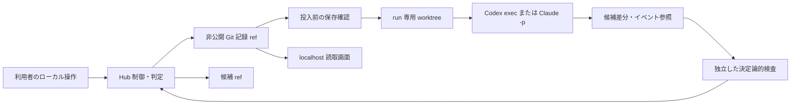

# Design Spec — 単一 PC の中央実行型 Hub PoC

**版**: 0.1 | **日付**: 2026-09-27 | **状態**: 提案中（コード未着手） | **要求**: [local-execution-requirement-spec.md](local-execution-requirement-spec.md)

本書は未実装の設計である。公開中の[リプレイ Design Spec](design-spec.md)と `src/replay/` の挙動を変更しない。J-SIX 本体の[実行・判定契約](https://github.com/SeckeyJP/j-six/blob/main/docs/control-plane/execution-contract.md) R1〜R8 と[PoC 限定 ADR-0009](https://github.com/SeckeyJP/j-six/blob/main/docs/control-plane/adr/0009-local-cli-execution-poc.md)を入力とする。適用するプロセス定義は `process.lock.json` に固定した版で、文書追加だけを理由に更新しない。

## 1. 構成と信頼境界

初期実装は既存の TypeScript/Node プロジェクト内の **ローカル制御プロセス** とし、判定を純粋関数、Git 記録、worktree 管理、CLI adapter、検査、読取画面に分ける（[Hub ADR-0007](../adr/0007-local-execution-poc.md)）。公開 Vite/React アプリを投入窓口にしない。実際のサブプロセス起動は Hub 経由の run だけ記録できる。別のターミナルから起動した CLI は検出・禁止できない。
ここで保存する許可は合成 fixture のローカル試験に限り、署名・本人確認のない正式な工程許可や J-SIX の Phase/Gate 承認には使わない。判定・記録・検査をモジュール上で分けても、同じ OS ユーザーのため信頼境界を実現したことにはならない。

| 主体 | PoC で行うこと | 証明できないこと |
|---|---|---|
| 作業 CLI | 専用 worktree に候補を作る | 同じ OS ユーザーの別パスへのアクセス遮断 |
| Hub 判定 | 固定入力から許可候補と理由を算出し、記録済みの根拠を照合 | 検査結果・人間承認の真正な発行 |
| 独立検査プロセス | worktree 外の固定した検査定義を使い、候補を評価する | 同一ユーザーからの定義改ざんを OS 権限だけで阻止 |
| 利用者 | 対象と結果を見てローカル確認操作をする | 外部本人確認、複数社の委任・承認権限 |
| Git 記録処理 | 期待 SHA と保存確認により履歴を追記 | 同一ユーザーによる履歴書換えへの改ざん耐性 |

## 2. Git 正本・記録形式

記録先はリモートのない非公開 Git repo `~/.local/state/j-six-hub-poc/ledger` を想定し、`refs/heads/poc-ledger` に追記する。公開 `j-six-hub`、親の運用記録、候補成果物の Git repo と分ける。run 専用 worktree は fixture repo の固定 commit から作り、受入れ済み候補だけ `refs/heads/poc-candidates/<run-id>` に期待 SHA 付きで反映する。記録先 ref と候補 ref の SHA は別々に比較する。絶対パス、プロンプトや生ログの本文、秘密値は正本に入れない。

最小 record は次の共通 envelope と型別 payload を持つ。schema と parser は段階1の実装に合わせて確定するが、意味と必須識別子はここで固定する。

| 共通項目 | 内容 |
|---|---|
| `schemaVersion`, `recordId`, `kind`, `recordedAt` | 形式・重複判定・種別・ローカル記録時刻。時刻だけを真正性の根拠にしない |
| `runId`, `commandId`, `generation` | 試行、外部作用、操作世代。再送は同じ command ID、新しい試行は新 run ID |
| `subject` | fixture repo、対象 commit、Task、許可パス、候補成果物集合の hash |
| `policy` | J-SIX process lock、方針/検査コード/設定の hash、必須検査集合、期限・失効参照 |
| `issuer`, `source`, `evidence` | 取得できた実行元・検査元、固定参照と hash。未取得は `unknown` とし、名前だけで本人確認済みとしない |

型別 payload は `run.proposed`、`permit.recorded`、`dispatch.requested`、`dispatch.claimed`、`dispatch.started`、`dispatch.outcome`、`inspection.recorded`、`operator.confirmed`、`revocation.recorded`、`candidate.accepted`、`reconciliation.recorded`、`cancel.requested` を最小集合とする。許可と `dispatch.requested` は同一の対象・方針・世代に結び付ける。worker の stdout/JSONL は Git 外のアクセス制限したローカル領域に保存し、記録には hash と参照の存在だけを載せる。保持・削除期間は実 CLI 実行前に決める。

追記は現在の記録 ref を読み、固定入力で新 commit を作り、期待 old SHA を指定して ref を更新する。更新結果と対象 record を再読込して一致を確認する。競合・書込失敗・応答不明なら `unknown`／保留とし、CLI を起動しない。再起動時の状態はこの ref の記録だけから投影する。記録がない外部作用を Git 再生だけで「未実行」と判定しない。

**投入の排他**：単一 PC のローカル状態ディレクトリに原子的な排他作成（`O_CREAT|O_EXCL` 相当）で操作 lock を置き、取得できた1制御処理だけが記録更新・dispatch・失効操作を行う。別の Hub 処理は lock 解放まで当該操作を待つか保留する。lock は spawn の最終判定から子プロセスの開始確認まで保持する。異常終了で lock が残った場合は自動奪取・自動再送せず、未確定 run と外部 CLI を照合してから人間が復旧記録を残して解放する。これは協力的な Hub 経路内の排他であり、同じ OS ユーザーが Hub 外で CLI を動かすことを防ぐ仕組みではない。

## 3. 状態・実行順序

状態は `proposed → held | permitted → requested → running → inspected → awaiting_operator → accepted` を基本とする。`failed`、`cancel_requested`、`cancelled`、`unknown`、`reconciling` は履歴を保持した分岐であり、結果不明を failed に丸めない。`held` からの再開は対象・方針・失効の再照合と新しい許可を要する。`cancel_requested` は停止確認ではない。

1. `hub-poc propose`（予定コマンド）は対象、許可パス、方針、CLI を指定し、CLI に触れずに判定する。同時1 run の所有権と世代を検査する。
2. 最新の記録 ref、対象 commit、方針 hash、必須検査、失効を読み、`permit.recorded` と `dispatch.requested` を記録先 ref に追記する。保存・再読込が確認できない間は spawn しない。
3. `hub-poc dispatch <run-id>`（予定）はサブスクリプション方式・環境変数・利用枠・権限を確認する。その後に操作 lock を取得して記録 ref を再読込し、同じ command ID に投入済み・claim済み・結果不明がないこと、同時 run がないこと、最新許可・期限・失効・対象/方針版・世代が一致することを **spawn 直前に再確認** する。失効・競合・期限切れなら保留する。通過時は期待 SHA 付きで `dispatch.claimed` を先行記録・保存確認し、その lock を解放せず CLI を spawn する。spawn 成否を記録した後に lock を解放する。失効要求も同じ操作 lock の直列化対象とし、最終確認より前に記録された失効は必ず止める。最終確認後の失効は起動後の取消し・結果隔離に進める。claim 後の crash は `unknown` とし、自動再送しない。
4. run 専用 worktree で CLI を起動し、起動前後の結果が不明なら自動再送せず、同じ run/command ID で外部状態を照合する。CLI に冪等実行の保証がない場合、未実行を一意に確認できなければ手動判断待ちにする。
5. CLI 終了後、全差分を固定して許可範囲と照合する。独立検査は worktree の候補から設定を採用せず、方針で固定した検査定義と必須集合から評価する。検査の欠落・skip・失敗・unknown を passed にしない。
6. `hub-poc confirm <run-id>`（予定）は証拠と未検証範囲を利用者に提示し、明示操作を Git に記録する。これは本人認証済み承認ではない。確認前に候補 ref を更新しない。
7. 取込み直前に失効、対象・方針・検査、記録/候補 ref、実行世代を再照合する。期待 SHA 付きで候補 ref を更新し、結果を Git に追記する。Git 記録と候補 ref の片方しか成功しなければ `unknown` として照合し、公開 main に自動反映しない。

ローカル制御プロセスの強制終了や PID 消失では、外部 CLI の終了を推測しない。起動前／起動後の crash、二重応答、失効後の遅着結果を fake adapter で注入し、重複作用や古い許可での取込みがないことを検査する。外部 CLI が一意な照合・取消しを提供しない区間は保留し、exactly-once を主張しない。
同じ run への2つの同時 dispatch と、要求保存後から spawn 前までの失効を必須の fake adapter ケースに加える。前者は spawn 1回以下、後者は0回とする。

## 4. CLI adapter と料金ガード

共通 interface は `preflight → spawn → collect → classify → reconcile` とする。`preflight` は**各 run 直前**に版、`codex login status`／`claude auth status --json` の認証方式、API key/access token/provider を選ぶ環境変数の有無、利用枠と追加クレジット設定、マシン共通 Hook の適用条件を調べる。キー値、トークン、メール、アカウント ID は出力しない。不明なら起動しない。利用量は同時1 run、初回実行は各 CLI の読取1回と小さな合成編集1回までに制限する。

| adapter | 予定する非対話起動 | 停止条件 |
|---|---|---|
| Codex | 保存済み ChatGPT 認証の `codex exec --json --sandbox workspace-write -C <worktree>`。ユーザー/プロジェクトの設定・Hook・rules を読み、bypass や ignore フラグを使わない | ChatGPT 以外の認証、API key/access token 環境、権限・上限・認証失効、JSONL 不明 |
| Claude Code | 保存済み `claude.ai` subscription の `claude -p --verbose --output-format stream-json --max-turns <n> --permission-prompts none`。必要最小の tools を許可し、`--bare`・権限 bypass を使わない | subscription 以外の認証、API key/provider 環境、権限・上限・認証失効、JSONL 不明 |

`--max-budget-usd` をサブスクリプション支出上限と見なさない。追加クレジットの利用を避けられることを確認できなければ live run を保留する。適用する CLI 版の引数と JSONL イベントを読取 smoke で確認してから編集 run に進む。[Codex 認証](https://learn.chatgpt.com/docs/auth)、[Codex 非対話実行](https://learn.chatgpt.com/docs/non-interactive-mode)、[Codex 利用枠](https://learn.chatgpt.com/docs/pricing)、[Claude CLI](https://code.claude.com/docs/en/cli-reference)、[Claude の現時点の subscription 利用扱い](https://support.claude.com/en/articles/15036540-use-the-claude-agent-sdk-with-your-claude-plan)。これらの条件は実行日にも再確認する。

## 5. 検査・UI・公開境界

有効方針は review 済みの固定版から読み、候補ブランチの `.jsix-checks.json` や worker の自己申告を基準にしない。最初の合成 fixture では、許可パス、Git 差分、対象/方針 hash、必須テスト、検査記録の対象・発行元を決定論的に検査する。別プロセスで実行しても同じ OS ユーザーなので、悪意ある worker から検査定義・記録先を保護した証明にはならない。hold-out は論理的に別入力とし、強制不可視とは表示しない。

localhost の画面は読取専用とし、run の対象、状態、Git 記録版、候補 ref、検査/確認の根拠、失効、`unknown`、未検証範囲を示す。確認操作は画面ボタンではなく、初期 PoC のローカル terminal コマンドで行う。画面とデータは公開リプレイの `data/events.jsonl`・`src/replay/` と混ぜず、実行イベントを `measured` のリプレイ記録に変換しない。公開する前にログ・個人情報・認証 cache・絶対パス混入を検査する。

## 6. 契約・試験対応

| J-SIX 契約 | PoC で検証する範囲 | 未証明・保留する範囲 |
|---|---|---|
| R1 | record の形式・対象・方針/環境の対応と未知形式拒否を合成検査。ローカル試験許可だけを扱う | 署名と独立した発行者権限・本人確認。正式な工程許可は出さない |
| R2 | 有効方針側の必須集合、欠落/skip/unknown の拒否 | 実 PJ 全検査の十分性 |
| R3 | 固定した期限と失効台帳による保留、通常改訂との区別 | 信頼できる外部時計、組織横断の失効配布 |
| R4 | 例外可能条件だけの合成判定と元の未達の保持 | 実組織の条件付き承認権限 |
| R5 | 委任の範囲・期限・取消しを合成入力で判定 | 実在の委任元権限と本人認証 |
| R6 | Git への先行記録、保存確認、期待 SHA、候補 ref 競合を検査 | OS 権限での経路強制、Git 更新と CLI 外部作用の原子性 |
| R7 | `unknown`、取消し・遅着・二重応答を fake adapter で検査 | CLI が提供しない一意の外部照合や exactly-once |
| R8 | 合成の対象/依存版不一致で保留、同時1 run の投入枠 | 複数チームの IF/DB 統合、レビュー容量・大規模並列 |

| 段階 | 実装・検証入口 | 主な受入条件 |
|---|---|---|
| 1 | 純粋判定、record schema、Git 投影・期待 SHA のテスト | AC-LE-01、PROP-LE-01 |
| 2 | fake adapter、worktree、独立検査、crash/競合/失効注入 | AC-LE-03〜05、PROP-LE-02/03 |
| 3 | CLI adapter、認証/課金 preflight、読取 smoke | AC-LE-02 |
| 4 | 両 CLI の小さな合成編集、確認と候補 ref の反映 | AC-LE-02〜05 |
| 5 | localhost 読取画面、再起動復元、リプレイ表示確認 | AC-LE-06 |

実装各段階の計画と成果物は別担当の独立レビューに通す。この Spec の成立だけで J-SIX プロセス全体への適合、企業実 PJ の適用、サブスクリプション請求の無条件保証を主張しない。
